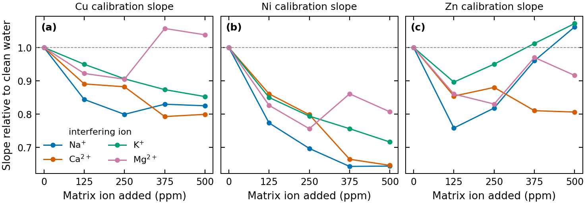
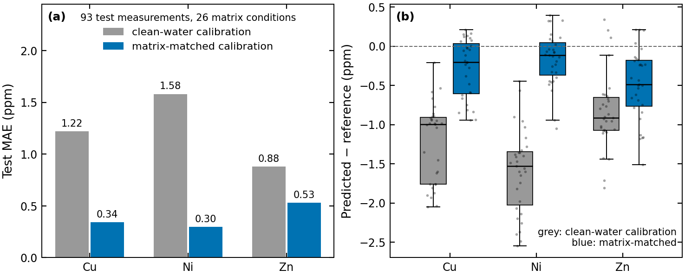

# Spectral Measurement Processing and Matrix-Matched Calibration

[](https://github.com/liangyuchen-research/mixture-of-experts-spectral-calibration/actions/workflows/checks.yml)

Tools and archived results for an ongoing study of how Na, Ca, K and Mg in solution distort plasma emission spectra, and how much matrix-aware calibration recovers. The public part of the project is the measurement-processing and calibration toolchain plus the numerical results of the archived analyses; the mixture-of-experts interference model that this work feeds is still under development and is not distributed here (see [Scope](#scope)).

Developed at the Plasma Engineering Laboratory, National Taiwan University, as a follow-up to the [Talanta 2026 quantification work](https://github.com/liangyuchen-research/plasma-spectroscopy-quantification).

## What the archived analyses show



*Calibration slope (line intensity per ppm) relative to clean water when a single interfering ion is added at 125–500 ppm, from `analysis/archived_results/per_matrix_r2/calibration_curves.csv`. Sodium and calcium suppress the Ni response by up to about 35 %; the Zn response is enhanced or suppressed depending on the ion.*



*Test error of the two calibration strategies on 93 measurements over 26 Na/Ca/K/Mg conditions (3 and 5 ppm). Using the calibration curve of the matching matrix condition instead of the clean-water curve cuts the mean absolute error from 1.22 → 0.34 ppm (Cu), 1.58 → 0.30 ppm (Ni) and 0.88 → 0.53 ppm (Zn), and removes most of the systematic under-reading. Both figures are produced by `scripts/make_figures.py` from the archived tables.*

## Available workflows

| Entry point | Purpose |
| --- | --- |
| `scripts/process_spectrometer_records.py` | Convert raw detector records (one background + ten signal files per group, 1,948 wavelength rows each) into background-corrected measurements and replicate summaries (`Concat`, `Mean`, `STD`, `RSD`, `Mean_3`) |
| `scripts/calibrate_matrix_condition.py` | Fit a Cu, Ni or Zn calibration within a selected Na/Ca/K/Mg condition, with optional reference-line or area normalization, and export predictions |
| `scripts/summarize_archived_results.py` | MAE, bias and RMSE from the archived model-error tables |
| `scripts/check_analysis.py` | Tests for parsing, aggregation, calibration recovery and invalid-input handling |
| `scripts/make_figures.py` | Regenerates the figures on this page |
| `analysis/archived_results/` | Original numerical outputs, grouped by analysis ([notes](analysis/README.md)) |
| `data/examples/` | A measured-spectrum table for inspecting the data format ([notes](data/examples/README.md)) |

## Quick start

Python 3.10–3.12; only NumPy, pandas, Matplotlib and scikit-learn are needed.

```bash
python -m venv .venv && source .venv/bin/activate      # .venv\Scripts\activate on Windows
python -m pip install -r requirements.txt
python scripts/check_analysis.py
python scripts/summarize_archived_results.py
python scripts/make_figures.py
```

Process a folder of detector records:

```bash
python scripts/process_spectrometer_records.py measurements --output results/measurement-run
```

Fit a matrix-specific calibration on the example table (the four values are the Na, Ca, K and Mg loads of the condition):

```bash
python scripts/calibrate_matrix_condition.py data/examples/sodium_matrix_calibration.csv --metal Cu --matrix 0 0 0 0 --output results/calibration-run
```

The command exports slope, intercept and training R² to `calibration.json`; add `--testing-csv` to export predictions. Testing concentrations follow the original convention of a divisor of 10 unless `--test-concentration-divisor 1` is given. Replicate summaries use sample standard deviations, and `Mean_3.csv` averages complete consecutive groups of three. Inputs are never overwritten.

## Scope

The research direction is a mixture-of-experts model of the *forward* interference process (clean spectrum + matrix condition → predicted interfered spectrum, with one expert per ion and staged training). Its model module is not part of this snapshot, so the training notebooks are kept privately and no runnable model is provided or claimed here; the archived `model_v6` tables are its historical outputs, summarised by `summarize_archived_results.py` from their rounded error columns. The [method notes](docs/METHOD.md) describe the modelling scheme, and the [reproduction notes](docs/REPRODUCIBILITY.md) list the protocol details that matter when reading the archived numbers (testing tables contain only 3 and 5 ppm; calibration was fitted on clean rows of the testing table).

## Data and code use

Original source and numerical data are preserved unchanged; checksums for the full research datasets are in `data/external_artifacts.json`. Contact the repository owner regarding reuse or additional research materials.
